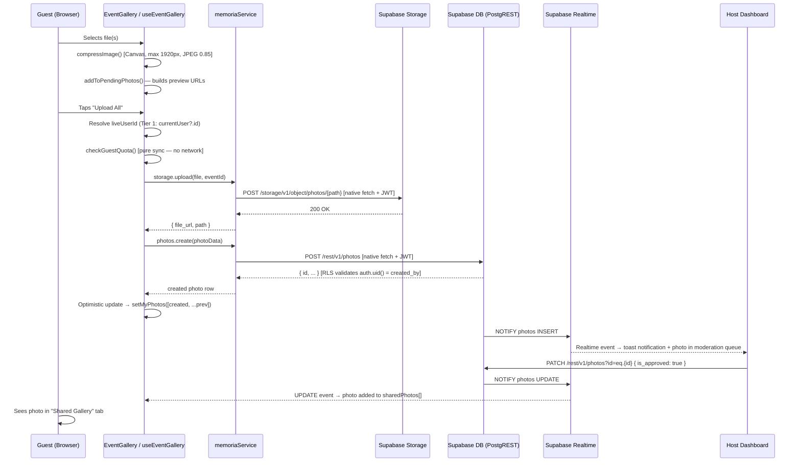

# MemoriaShare — Master System Specification
**Authority:** This document is the single Source of Truth for the current production state of MemoriaShare (April 2026).  
**Supersedes:** `PRD.md` (product intent), `docs/ARCHITECTURE_SPEC.md` (auth sub-spec).  
**Last updated:** 2026-04-07

---

## Table of Contents

1. [Executive Summary & Product Vision](#1-executive-summary--product-vision)
2. [Full Feature Inventory](#2-full-feature-inventory)
3. [Technical Stack & Service Architecture](#3-technical-stack--service-architecture)
4. [Logic & Data Flow — The Upload Lifecycle](#4-logic--data-flow--the-upload-lifecycle)
5. [Database Schema & Security](#5-database-schema--security)
6. [Scalability & Performance Analysis](#6-scalability--performance-analysis)
7. [Business & Monetization Model](#7-business--monetization-model)
8. [Project Status & Roadmap](#8-project-status--roadmap)

---

## 1. Executive Summary & Product Vision

### What is MemoriaShare?

MemoriaShare is a real-time event photo-sharing PWA. A host creates a digital album, shares a QR code or link, and guests upload photos directly from their browser — no app download, no account required.

> **Core value proposition:** "Guests shoot. Everything lands in one album."

The product solves a universal post-event problem: hundreds of photos spread across dozens of phones, collected days later via WhatsApp chains. MemoriaShare captures them *during* the event.

### Target Audience

| Role | Auth method | Key pain point |
|---|---|---|
| **Host / Organizer** | Google OAuth (Supabase) | Wants all guest photos in one managed place |
| **Guest** | Anonymous Sign-In (Supabase) | Wants zero-friction sharing — no account, no install |
| **Co-host** | Added by host email; uses Google OAuth | Needs moderation access without owning the event |

### Architectural Philosophy

The app is intentionally server-light. All image processing (compression, watermarking, filter application) runs client-side via the Canvas API. Supabase provides Auth, PostgreSQL, Storage, and Realtime as managed services. There is no custom backend — every server-side rule is expressed as an RLS policy.

---

## 2. Full Feature Inventory

### 2.1 Guest Experience

#### Entry Flow
1. Guest scans QR code or follows shared link → `/Event?code=XXXX` (landing/splash page).
2. Event metadata is loaded; quota is checked synchronously via `checkGuestQuota()`.
3. If quota is not exhausted, a single CTA button ("התחילו לצלם") navigates to `/EventGallery?code=XXXX`.
4. On the gallery page, a **Guest Book modal** prompts for:
   - **Name** (required) — stored in `localStorage['ms_guest_name']` and `user_metadata.display_name`
   - **Greeting to the couple** (optional) — stored in `localStorage['ms_guest_greeting']`
5. Modal submission triggers `supabase.auth.signInAnonymously()` if no session exists, then `supabase.auth.updateUser()` to attach the name to the anonymous user's metadata (background, non-blocking).

#### Identity Persistence ("Remembering Nati Abebe")

A returning guest on the same browser-device is recognized without ever seeing the Guest Book again:

```
On mount (EventGallery):
  1. AuthContext.getSession() resolves → currentUser populated (same UUID as before)
  2. Identity restoration effect runs:
     - if localStorage['ms_guest_name'] is set → skip modal (normal path)
     - if NOT set but currentUser.user_metadata.display_name exists → restore from metadata
       → write to localStorage → call closeGuestBook() → modal never shown
  3. getMyPhotos() fetches with that UUID → same "My Photos" as before
  4. checkGuestQuota() receives same user_upload_count → same remaining quota
```

The Supabase anonymous session persists via a refresh token stored in `localStorage['sb-{project}-auth-token']`. As long as this token is valid, `auth.uid()` remains the same UUID across page refreshes, browser restarts, and re-entries via QR code.

#### Photo Upload with Client-Side Processing

```
User selects file(s)
    ↓
compressImage() [Canvas API]
    - max dimension: 1920px
    - output: JPEG 0.85 quality
    - filters applied: none | vintage (sepia+date-stamp) | black_white (grayscale)
    ↓
addToPendingPhotos() — builds pendingPhotos[] with preview URLs
    ↓
User reviews pending batch in PendingGallery
    ↓
uploadAllPendingPhotos() — batches of 3 concurrent uploads
    ↓
memoriaService.storage.upload() [native fetch — see §3.4]
    ↓
memoriaService.photos.create() [native fetch — see §3.4]
    ↓
Optimistic UI update → photo appears in My Photos immediately
    ↓
Confetti + vibration on success
```

File constraints: max 50 MB per file, image/* only.

#### Live Gallery

- **"My Photos" tab:** All photos where `created_by = auth.uid()`, including pending-approval ones. Fetched via `getMyPhotos()`.
- **"Shared Gallery" tab:** Approved, non-hidden photos (`is_approved=true AND is_hidden=false`). Only visible when `event.auto_publish_guest_photos = true`. When the host disables the public gallery, this tab is hidden and replaced with a notice banner.
- **Realtime updates:** Supabase Realtime subscription on `photos` filtered by `event_id`. INSERT events append to the shared gallery; UPDATE events (approval/hiding) merge in-place; DELETE events remove from all arrays.
- **Infinite scroll:** `PHOTOS_PER_PAGE = 30`, loaded in offset pages via `fetchNextPage()`.
- **PhotoViewer:** Full-screen lightbox with keyboard navigation (←/→), touch swipe, watermarked download, and Web Share API.

---

### 2.2 Host / Admin Experience

#### Event Creation (`CreateEvent.jsx`)

5-step wizard:
1. Event name + date
2. Cover image (uploaded, compressed to 1200px/0.7 JPEG, displayed in live iPhone mockup)
3. Guest tier selection (pricing/capacity slider)
4. Photos-per-person limit (`max_uploads_per_user`, default: 15)
5. Privacy mode (default: `manual` → `auto_publish_guest_photos = false`)

On submit: `memoriaService.events.create()` strips UI-only fields (`privacy_mode`, `event_type`, `description`, `price`, `qr_code`, `photo_filter`) and maps `privacy_mode → auto_publish_guest_photos`.

#### Dashboard (`Dashboard.jsx`)

Four tabs:

| Tab | Content |
|---|---|
| **Gallery** | Full `EventGallery` in `isAdminView=true` mode — host sees all photos regardless of approval status |
| **Settings** | Edit name, cover image, toggle public gallery (`auto_publish_guest_photos`), set `upload_closure_datetime` |
| **Co-hosts** | Add/remove co-host emails; co-hosts get full moderation access |
| **Export** | Client-side ZIP download via JSZip with progress bar |

**Moderation flow:**
- Host sees unapproved photos as a queue
- Approve → `is_approved = true` → photo enters Shared Gallery
- Hide → `is_hidden = true` → photo disappears from Shared Gallery but remains in My Photos
- Delete → hard delete from DB and Storage

**Realtime notifications (host-side):** `useRealtimeNotifications` hook subscribes to the same `photos` channel, compares `photo.created_by` (UUID) to `currentUser.id` (UUID) to suppress self-notifications, and displays a toast when a guest uploads.

---

## 3. Technical Stack & Service Architecture

### 3.1 Frontend

| Technology | Version | Role |
|---|---|---|
| React | 18 | UI, hooks, context |
| Vite | 6 | Build tool, `@/` alias, HMR |
| Tailwind CSS | 3 | Utility styling, mobile-first |
| React Router | v6 | `BrowserRouter`, `<Routes>`, `useNavigate` |
| shadcn/ui + Radix UI | — | Accessible headless components |
| Framer Motion | — | Modal transitions, animations |
| @supabase/supabase-js | v2 | Auth, DB, Storage, Realtime client |
| @tanstack/react-query | — | Server state (used in some pages) |
| canvas-confetti | — | Upload success celebration |
| JSZip | — | Client-side ZIP export |
| @vercel/speed-insights | — | Real-user performance monitoring |

**State architecture:**

```
App
├── AuthProvider (AuthContext.jsx)         ← single session owner
│   └── user, isLoadingAuth, isAuthenticated
├── QueryClientProvider
└── Router
    ├── /EventGallery
    │   └── useEventGallery (hook)         ← all gallery state
    │       ├── event, photos, myPhotos, sharedPhotos
    │       ├── pendingPhotos, isUploadingBatch
    │       └── uploadAllPendingPhotos()
    └── /Dashboard
        └── useRealtimeNotifications (hook)
```

**Routing:**

```
/                  → Home (landing)
/Event?code=XXXX   → Event entry/splash page
/EventGallery?code=XXXX → Guest gallery
/CreateEvent       → Event creation wizard
/EventSuccess      → Post-creation share screen
/Dashboard?id=XXXX → Host management panel
```

`vercel.json` rewrites all routes to `index.html` to enable SPA deep linking.

---

### 3.2 Supabase Services

#### Authentication

- **Hosts:** Google OAuth 2.0 via `supabase.auth.signInWithOAuth({ provider: 'google' })`
- **Guests:** `supabase.auth.signInAnonymously()` — produces a real UUID in `auth.users` with `is_anonymous = true`, no email
- **Session storage:** Supabase JS v2 persists the access + refresh token in `localStorage['sb-{project-ref}-auth-token']`
- **Profile creation:** A PostgreSQL trigger `handle_new_user()` (AFTER INSERT on `auth.users`) auto-creates a `profiles` row for non-anonymous users only. Anonymous users are explicitly skipped with `IF NEW.is_anonymous THEN RETURN NEW; END IF;`

#### Database (PostgreSQL via PostgREST)

All queries go through `memoriaService.jsx` using the `supabase-js` client, **except** storage uploads and photo inserts which use native `fetch` (see §3.4).

#### Realtime

```javascript
supabase
  .channel(`photos-realtime-${eventId}`)
  .on('postgres_changes',
    { event: '*', schema: 'public', table: 'photos', filter: `event_id=eq.${eventId}` },
    handler
  )
  .subscribe();
// cleanup:
return () => supabase.removeChannel(channel);
```

`photos` table has `REPLICA IDENTITY FULL` so UPDATE and DELETE payloads include the full before/after row.

---

### 3.3 Service Layer (`memoriaService.jsx`)

All Supabase interactions are centralized here. Components and hooks never call `supabase.from()` directly.

```
memoriaService
├── auth.me()              ← getUser() — host profile pages only
├── auth.redirectToLogin() ← signInWithOAuth
├── auth.logout()          ← signOut + redirect
├── events.list()          ← sorted event listing
├── events.listByUser()    ← host's own events
├── events.get(id)         ← by UUID
├── events.getByCode(code) ← by unique_code (guest entry point)
├── events.create(data)    ← strips UI-only fields, maps privacy_mode
├── events.update(id, data)
├── events.delete(id)
├── photos.getByEvent()    ← paginated, filterable, multi-sort
├── photos.create()        ← ⚠️ NATIVE FETCH (see §3.4)
├── photos.delete(id)
├── photos.approve(id)
├── photos.update(id, data)
├── storage.upload()       ← ⚠️ NATIVE FETCH (see §3.4)
└── storage.getSignedUrl() ← supabase-js (used for private paths)
```

---

### 3.4 The Native Fetch Bypass (Critical Architecture Decision)

#### The Problem: Supabase v2 Auth Mutex Deadlock

`@supabase/supabase-js` v2 serializes all auth state changes through an internal async mutex. At EventGallery mount, three operations compete for this mutex simultaneously:

1. `AuthContext.getSession()` — resolving the existing session on page load
2. `EventGallery` effect — `signInAnonymously()` if no session exists
3. (Previously) `GuestBook` — a second `signInAnonymously()` call

Any subsequent Supabase call — including `supabase.from('photos').insert()` and `supabase.storage.upload()` — calls `_fetchWithAuth()` internally, which reads the current session JWT. If the session refresh is in flight, `_fetchWithAuth` joins the mutex queue and **never resolves**. This manifested as silent upload failures with no error thrown and no spinner appearing.

#### The Solution: Direct REST API Calls

`memoriaService.storage.upload()` and `memoriaService.photos.create()` bypass the `supabase-js` client entirely and call Supabase's REST/Storage APIs via native `fetch`:

```javascript
// _getJwt() — reads JWT directly from localStorage, no mutex involved
function _getJwt() {
  const supabaseAnonKey = import.meta.env.VITE_SUPABASE_ANON_KEY;
  try {
    const storageKey = Object.keys(localStorage)
      .find(k => k.startsWith('sb-') && k.endsWith('-auth-token'));
    if (storageKey) {
      const session = JSON.parse(localStorage.getItem(storageKey));
      if (session?.access_token) return session.access_token;
    }
  } catch { /* non-fatal */ }
  return supabaseAnonKey; // fallback to anon key
}

// Storage upload — POST directly to Supabase Storage REST API
fetch(`${supabaseUrl}/storage/v1/object/photos/${path}`, {
  method: 'POST',
  headers: {
    'Authorization': `Bearer ${jwt}`,
    'apikey': supabaseAnonKey,
    'Content-Type': file.type || 'image/jpeg',
    'x-upsert': 'false',
  },
  body: file,
});

// DB insert — POST directly to PostgREST
fetch(`${supabaseUrl}/rest/v1/photos`, {
  method: 'POST',
  headers: {
    'Authorization': `Bearer ${jwt}`,
    'apikey': supabaseAnonKey,
    'Content-Type': 'application/json',
    'Prefer': 'return=representation',
  },
  body: JSON.stringify(photoData),
});
```

**Security note:** RLS still enforces `auth.uid() = created_by` server-side. A guest cannot forge a different UUID in the body — the JWT's `sub` claim must match.

---

### 3.5 Identity Restoration on Refresh (F5 Handling)

**Problem:** On page refresh, React state is cleared. `isLoadingAuth = true` initially. The Guest Book modal's visibility is computed as `!localStorage['ms_guest_name']`. If localStorage was cleared (OS eviction, private browsing, different tab), the guest name is gone but the Supabase session (anonymous UUID) is still valid — the user would be shown the Guest Book again, creating a new anonymous UUID and losing their "My Photos" and quota.

**Solution:** An identity restoration effect in `EventGallery.jsx`:

```javascript
useEffect(() => {
  if (isAdminView || !currentUser?.isAnonymous) return;
  const storedName = localStorage.getItem(GUEST_NAME_KEY);
  if (storedName) return; // already set — nothing to restore

  const metaName =
    currentUser.user_metadata?.display_name ||
    currentUser.user_metadata?.full_name;
  if (!metaName) return; // genuinely new visitor — show Guest Book

  // Returning guest: restore from server metadata → skip modal
  localStorage.setItem(GUEST_NAME_KEY, metaName);
  const greeting = currentUser.user_metadata?.guest_greeting;
  if (greeting) localStorage.setItem('ms_guest_greeting', greeting);
  closeGuestBook();
}, [currentUser?.id, isAdminView, closeGuestBook]);
```

The effect depends on `currentUser?.id` (not the whole object) to avoid re-running on unrelated re-renders.

**F5 boot sequence:**

```
AuthContext mounts
  → getSession() reads localStorage token (no network)
  → onAuthStateChange fires INITIAL_SESSION
  → fetchUserWithProfile() called
      → if is_anonymous: return base object immediately (NO profiles DB call)
      → if host: fetch profiles row
  → setUser(enriched), settle() → isLoadingAuth = false

EventGallery renders (isLoadingAuth now false)
  → Anonymous sign-in effect: currentUser already set → skips signInAnonymously()
  → Identity restoration effect: checks metadata → restores name if needed
  → Phase 1 effect: loads event data
  → Phase 2 effect: loads photos with known UUID
```

**Safety timer:** `AuthContext` has an 8-second fallback `setTimeout` that calls `settle()` regardless — the app unblocks even if the Supabase project is paused, the network is down, or an unexpected promise rejection occurs.

---

## 4. Logic & Data Flow — The Upload Lifecycle

### 4.1 Complete Photo Journey



### 4.2 The 3-Tier User ID Resolution

Before any upload, `uploadAllPendingPhotos()` resolves the guest's UUID without blocking:

```
Tier 1 (zero cost): currentUser?.id from AuthContext React state
         ↓ null?
Tier 2 (localStorage read, ~0ms): supabase.auth.getSession() with 2s Promise.race timeout
         ↓ null?
Tier 3 (network): supabase.auth.signInAnonymously()
```

Tier 1 succeeds in >99% of uploads because `onAuthStateChange` has already populated `currentUser` by the time a guest taps "Upload".

### 4.3 Realtime Update Handling

| Event type | Handler |
|---|---|
| `INSERT` (other user) | Show live notification toast; guest sees their own upload via optimistic update |
| `UPDATE` → `is_approved: true` | Add photo to `sharedPhotos[]` if not hidden |
| `UPDATE` → `is_hidden: true` | Remove from `sharedPhotos[]`, keep in `myPhotos[]` |
| `DELETE` | Remove from all three arrays (`photos`, `myPhotos`, `sharedPhotos`) |

---

## 5. Database Schema & Security

### 5.1 Table Structures

#### `profiles`
| Column | Type | Notes |
|---|---|---|
| `id` | UUID PK | FK → `auth.users(id)` ON DELETE CASCADE |
| `email` | TEXT | NULL for anonymous users (trigger skips them) |
| `full_name` | TEXT | From Google OAuth metadata |
| `phone` | TEXT | Collected during host onboarding |
| `avatar_url` | TEXT | From Google profile picture |
| `role` | TEXT | `'user'` or `'admin'`; CHECK constraint |
| `created_at` | TIMESTAMPTZ | |
| `updated_at` | TIMESTAMPTZ | |

**Key note:** The `handle_new_user()` trigger explicitly skips anonymous users (`IF NEW.is_anonymous THEN RETURN NEW`). Without this, every `signInAnonymously()` call would create a junk profiles row.

#### `events`
| Column | Type | Default | Notes |
|---|---|---|---|
| `id` | UUID PK | `gen_random_uuid()` | |
| `name` | TEXT | | Required |
| `unique_code` | TEXT | | UNIQUE; used in QR/share URLs |
| `pin_code` | TEXT | NULL | Reserved; not enforced in UI yet |
| `created_by` | UUID | | FK → `auth.users(id)`; host UUID |
| `co_hosts` | TEXT[] | `'{}'` | Array of emails (legacy; UUID migration deferred) |
| `date` | DATE | NULL | DATE not TIMESTAMPTZ — avoids timezone-shift bugs |
| `cover_image` | TEXT | NULL | Public Storage URL |
| `guest_tier` | INTEGER | 1 | Index into `GUEST_TIER_LIMITS[]` |
| `max_uploads_per_user` | INTEGER | 15 | Per-guest upload cap |
| `upload_closure_datetime` | TIMESTAMPTZ | NULL | Hard cutoff for all uploads |
| `auto_publish_guest_photos` | BOOLEAN | **FALSE** | Controls public gallery visibility |
| `is_active` | BOOLEAN | TRUE | Inactive events show "closed" screen |
| `created_date` / `updated_date` | TIMESTAMPTZ | NOW() | |

#### `photos`
| Column | Type | Default | Notes |
|---|---|---|---|
| `id` | UUID PK | | |
| `event_id` | UUID | | FK → `events(id)` ON DELETE CASCADE |
| `file_url` | TEXT | NULL | Public Storage URL (primary display URL) |
| `path` | TEXT | NULL | Storage path: `{event_id}/{timestamp}_{random}.{ext}` |
| `file_urls` | JSONB | NULL | `{ thumbnail, medium, original }` — reserved for future resize pipeline |
| `guest_name` | TEXT | NULL | Display name from Guest Book modal |
| `guest_greeting` | TEXT | NULL | Optional message to host |
| `created_by` | UUID | NULL | FK → `auth.users(id)` ON DELETE SET NULL |
| `device_uuid` | TEXT | NULL | **Deprecated** — legacy fallback, superseded by anonymous auth |
| `filter_applied` | TEXT | `'none'` | CHECK: `none\|black_white\|vintage\|warm` |
| `is_approved` | BOOLEAN | FALSE | Must be set true by host to appear in Shared Gallery |
| `is_hidden` | BOOLEAN | FALSE | True = hidden from Shared Gallery |
| `deletion_status` | TEXT | `'none'` | CHECK: `none\|requested\|approved\|denied` |
| `created_date` / `updated_date` | TIMESTAMPTZ | | |

#### `upload_diagnostics`
Diagnostic table for upload debugging. Not shown in guest/host UI. Populated optionally by diagnostic code. Contains `photo_id`, `event_id`, `file_url` snapshot, and a `diagnosis` enum (`ok\|missing_file_urls\|missing_both`).

### 5.2 Indexes

| Index | Table | Columns | Purpose |
|---|---|---|---|
| `idx_photos_event_id` | photos | `event_id` | Primary gallery query |
| `idx_photos_event_approved` | photos | `event_id, is_approved` | Shared gallery query |
| `idx_photos_created_by` | photos | `created_by` | "My Photos" fetch |
| `idx_photos_device_uuid` | photos | `device_uuid` | Legacy lookup (deprecated) |
| `idx_events_unique_code` | events | `unique_code` | QR code entry (hottest query) |
| `idx_events_created_by` | events | `created_by` | Host's event list |

### 5.3 RLS Policies — Performance-Optimized

All `auth.*()` function calls are wrapped in `(select ...)` sub-selects. This instructs PostgreSQL's query planner to evaluate them once per statement as an **initplan** rather than once per row. At 500 photos per query this is the difference between 500 function calls and 1.

```sql
-- ❌ Before optimization (per-row evaluation)
USING (auth.uid() = created_by)

-- ✅ After optimization (once-per-statement)
USING ((select auth.uid()) = created_by)
```

**Policy summary:**

| Policy | Table | Op | Rule |
|---|---|---|---|
| `profiles_select_self` | profiles | SELECT | Own row only |
| `profiles_select_admin` | profiles | SELECT | `is_admin()` SECURITY DEFINER |
| `profiles_update_self` | profiles | UPDATE | Own row only |
| `profiles_update_admin` | profiles | UPDATE | `is_admin()` |
| `profiles_insert_self` | profiles | INSERT | `auth.uid() = id` |
| `events_select_public` | events | SELECT | `is_active=true` OR own event |
| `events_insert_authenticated` | events | INSERT | `auth.role()='authenticated' AND auth.email() IS NOT NULL` (blocks anonymous) |
| `events_update_owner` | events | UPDATE | `created_by` match OR co-host email in JWT |
| `events_delete_owner` | events | DELETE | `created_by` match only |
| `photos_select_public` | photos | SELECT | `is_hidden=false AND (is_approved=true OR auto_publish=true)` |
| `photos_select_own` | photos | SELECT | `auth.uid() = created_by` (guests see own pending photos) |
| `photos_select_owner` | photos | SELECT | Event owner or co-host — sees all including hidden |
| `photos_insert_authenticated` | photos | INSERT | `auth.uid() IS NOT NULL AND auth.uid() = created_by` |
| `photos_update_uploader` | photos | UPDATE | Own photos only; `deletion_status IN ('none','requested')` |
| `photos_update_owner` | photos | UPDATE | Event owner or co-host — unrestricted field update |
| `photos_delete_owner` | photos | DELETE | Uploader OR event owner/co-host |
| `upload_diagnostics_insert/select` | upload_diagnostics | INSERT/SELECT | Any `authenticated` role |
| `storage_photos_select_public` | storage.objects | SELECT | Any (public bucket) |
| `storage_photos_insert_public` | storage.objects | INSERT | Any (RLS on photos table is the real gate) |
| `storage_photos_delete_owner` | storage.objects | DELETE | `auth.uid()::text = foldername[1]` (folder = event_id) |

**`is_admin()` helper (SECURITY DEFINER):**
```sql
SELECT EXISTS (SELECT 1 FROM profiles WHERE id = auth.uid() AND role = 'admin');
```
Called with `SECURITY DEFINER` to bypass RLS when checking admin status — prevents the 42P17 infinite recursion that would occur if the SELECT on profiles triggered the profiles policy which called `is_admin()` again.

### 5.4 Privacy Enforcement: `auto_publish_guest_photos`

This single boolean controls three enforcement layers:

| Layer | Enforcement |
|---|---|
| **RLS (DB)** | `photos_select_public` allows SELECT only if `auto_publish_guest_photos = true` OR `is_approved = true`. When false and photo is not approved, it is invisible to other guests at the database level. |
| **Application fetch** | `fetchPhotosByPage()` in `useEventGallery.js` skips the shared-photos PostgREST query entirely when `event.auto_publish_guest_photos = false`, saving a DB round-trip. |
| **UI** | `EventGallery.jsx` hides the "Shared Gallery" tab and renders a notice banner when `auto_publish_guest_photos = false`. |

---

## 6. Scalability & Performance Analysis

### 6.1 Concurrent Upload Handling (100 simultaneous guests)

**Storage:** Each upload is an independent `POST /storage/v1/object/photos/{path}`. Paths include `Date.now() + Math.random().toString(36)` to guarantee uniqueness. No locking, no conflicts.

**DB inserts:** Each `POST /rest/v1/photos` is an independent INSERT. PostgreSQL handles concurrent inserts with row-level locks only — no table-level contention.

**Quota enforcement:** `checkGuestQuota()` is a **pure client-side function** with no DB writes. It reads already-loaded React state. There is no optimistic lock or server-side decrement. This means:

> **Known limitation:** The `guest_tier` unique-user count and `max_uploads_per_user` are soft limits — they are UX guardrails, not atomic database constraints. Under extreme concurrency (100 guests uploading in the same second), a small overshoot is possible. The RLS `photos_insert_authenticated` policy is the only hard gate, and it only validates identity, not quota.

For production at scale, a Supabase Edge Function or a PostgreSQL CHECK constraint / trigger enforcing quota atomically would be required.

**Realtime at scale:** Each gallery page opens one WebSocket channel filtered by `event_id`. At 100 connected guests, the Supabase project handles 100 concurrent WebSocket connections, each receiving ~100 INSERT/UPDATE events. This is well within Supabase's free tier channel limits.

### 6.2 Memory Management

**Object URLs:**
- `compressImage()`: creates one `createObjectURL`, revokes it in `img.onload` and `img.onerror`
- `addToPendingPhotos()`: creates a preview URL per pending photo; revoked on `removeFromPendingPhotos()`, `clearAllPendingPhotos()`, and after successful upload in `uploadAllPendingPhotos()`
- `handleDownloadPhoto()`: creates URL for `<a>` click, revokes immediately after
- `changePhotoFilter()`: revokes the old preview URL before creating the new one

No persistent object URLs are held beyond their immediate use. No memory leaks identified.

**Realtime subscription cleanup:**
Both `useEventGallery` and `useRealtimeNotifications` return `() => supabase.removeChannel(channel)` from their `useEffect` hooks. The AuthContext subscription calls `subscription.unsubscribe()` on cleanup. No dangling subscriptions on unmount.

### 6.3 Rendering Performance at 500+ Photos

**Current approach:** Photos are loaded in pages of 30 (`PHOTOS_PER_PAGE = 30`) via an infinite-scroll observer. The state arrays (`photos`, `myPhotos`, `sharedPhotos`) grow linearly. At 500 photos, the arrays hold 500 objects in memory — acceptable for a mobile browser.

**Known scaling risk:** `PhotoGrid` renders all loaded photos at once with no windowing/virtualization. `react-virtuoso` is already in `package.json` but not yet wired to the gallery. At 500+ photos, this will cause visible render jank on low-end devices. This is the primary performance improvement needed before high-volume events.

---

## 7. Business & Monetization Model

### 7.1 Tier System

The tier system is defined in `CreateEvent.jsx` and enforced by `checkGuestQuota.js`:

```javascript
const GUEST_TIER_LIMITS = [10, 100, 250, 400, 600, 800, Infinity];
```

| Tier index | Max unique uploaders | Price (ILS) |
|---|---|---|
| 0 | 10 | Free |
| 1 | 100 | ₪360 |
| 2 | 250 | ₪540 |
| 3 | 400 | ₪720 |
| 4 | 600 | ₪900 |
| 5 | 800 | ₪1,080 |
| 6 | ∞ | Contact |

The `guest_tier` integer stored on the `events` row is an index into this array, not a guest count.

### 7.2 Per-User Quota

`max_uploads_per_user` (default: 15) limits how many photos a single anonymous UUID can upload. Set by the host during event creation or updated in the Dashboard.

**Exemptions (hardcoded in `useEventGallery.js`):**

| Condition | Max uploads |
|---|---|
| `currentUser.email === 'effitag@gmail.com'` (super-admin) | 200 |
| `event.created_by === currentUser.id` (event owner) | 200 |
| Co-host email match | 50 |
| All other guests | `event.max_uploads_per_user` |

### 7.3 Quota Enforcement Logic (`checkGuestQuota.js`)

Three rules checked in order:

1. **Event closure:** `upload_closure_datetime < now()` → blocked, quota_type: `event_closed`
2. **Guest tier:** unique uploaders in loaded `photos[]` ≥ `GUEST_TIER_LIMITS[guest_tier]` AND current user is new → blocked, quota_type: `guest_tier`
3. **Per-user:** `user_upload_count >= max_uploads_per_user` → blocked, quota_type: `per_user`

Event owner is exempt from all three rules.

**Integration points:**
- `Event.jsx` (splash page): called synchronously on event load to show a block screen before entering the gallery
- `uploadAllPendingPhotos()` in `useEventGallery.js`: called before starting batch uploads
- `addToPendingPhotos()`: incremental check before adding each photo to the pending queue

---

## 8. Project Status & Roadmap

### 8.1 Critical Fixes Shipped (April 2026)

| Fix | Root cause | Resolution |
|---|---|---|
| **Silent upload failures** | Supabase v2 auth mutex deadlock at mount | Native fetch bypass for storage + DB insert; 3-tier user ID resolution |
| **F5 black screen / permanent spinner** | `getSession().then()` had no `.catch()`; `fetchUserWithProfile` called profiles DB for anonymous users; EventGallery fired concurrent `getSession()` at mount | Added `.catch()` + 8s safety timer to AuthContext; anonymous users skip profiles fetch; EventGallery defers sign-in until after AuthContext resolves |
| **"Event not found" regression** | `Event.jsx` read stale React state after `setEvent()` | Pass raw DB result directly to `checkEventQuota()` |
| **Admin approval 500 error** | `photos_update_uploader` WITH CHECK had a self-referencing subquery causing PostgreSQL 42P17 infinite recursion | Simplified WITH CHECK to `deletion_status IN ('none', 'requested')` |
| **RLS performance** | `auth.uid()` evaluated per-row across 35 policies | All auth calls wrapped in `(select ...)` initplan pattern; 7 redundant policies merged |
| **Junk profiles rows** | `handle_new_user()` trigger created rows for anonymous users | Added `IF NEW.is_anonymous THEN RETURN NEW` guard |
| **Self-notification bug** | `useRealtimeNotifications` compared `photo.created_by` (UUID) to `currentUserEmail` (email string) — always false | Renamed param to `currentUserId`, comparison now UUID↔UUID |

### 8.2 Known Limitations (Pre-Production)

| Issue | Severity | Mitigation |
|---|---|---|
| Quota is a soft client-side check | Medium | Acceptable for v1; add DB trigger for atomic enforcement at scale |
| No photo virtualization | Medium | Add `react-virtuoso` to PhotoGrid for events >200 photos |
| Co-hosts stored as emails (legacy) | Low | UUID migration deferred; current code works but is inconsistent with UUID-first architecture |
| `device_uuid` column unused | Low | Dead column; safe to drop in a future migration |
| `upload_diagnostics` table never written to in current code | Low | Diagnostic scaffolding; either wire it or drop it |

### 8.3 Recommended Tools

| Category | Tool | Rationale |
|---|---|---|
| **Error monitoring** | [Sentry](https://sentry.io) | Vite source map upload, React error boundaries, breadcrumbs, session replay. Free tier covers low-volume launches. |
| **Real-user performance** | [Vercel Speed Insights](https://vercel.com/docs/speed-insights) | Already in `package.json` (`@vercel/speed-insights`). Zero config. Measures Core Web Vitals per real visitor on `memoriashare.com`. |
| **Load testing** | [k6](https://k6.io) (Grafana) | Scriptable in JavaScript; can simulate 100 concurrent anonymous sign-ins + photo uploads against the PostgREST and Storage endpoints. Open source, free. |

### 8.4 Roadmap (from PRD Phase 2–4)

**Phase 2 — Richer experience**
- Face tagging with automatic person detection
- Mobile-optimized host moderation UI (approve photos in real time from the event floor)
- Password-protected gallery access
- PDF print-ready photo sheet

**Phase 3 — Monetization**
- Stripe integration for tier upgrades
- White-label branding (host logo on gallery + QR card)
- Public API for integration with event platforms

**Phase 4 — Infrastructure scale**
- Supabase Edge Function for server-side image resize + EXIF stripping
- Windowed/virtualized PhotoGrid (react-virtuoso) for 500+ photo events
- CDN layer (CloudFront or Supabase CDN) for global low-latency delivery
- Atomic quota enforcement via PostgreSQL trigger
- Webhook notifications (WhatsApp / email) to host on new uploads

---

## Appendix A: Where Current Code Differs from `ARCHITECTURE_SPEC.md`

| Spec section | What the spec says | What the code actually does |
|---|---|---|
| Step C | `signInAnonymously()` must complete before Step D | Modal closes + localStorage written **before** `updateUser()` completes (intentional — prevents `onAuthStateChange` race reopening modal) |
| Step D | `localStorage` key is `guest_name_{eventId}` | Actual key is `ms_guest_name` (global, not scoped to eventId) |
| Step E | Uses `supabase.auth.getUser().id` for `created_by` | Uses `currentUser?.id` from AuthContext React state; falls back to `getSession()` with 2s timeout; never calls `getUser()` in the upload path |
| Step F | Display name looked up from `auth.users` metadata via join or RPC | Display name is stored directly on `photos.guest_name` at insert time; no join required |
| Auth flow | "check session" → "no session" in sequence diagram | AuthContext now owns session check; EventGallery waits for `isLoadingAuth = false` before calling `signInAnonymously()` |

---

*This document reflects the production codebase as of 2026-04-07. Update it before merging any change that affects auth flow, DB schema, RLS policies, or the upload pipeline.*
